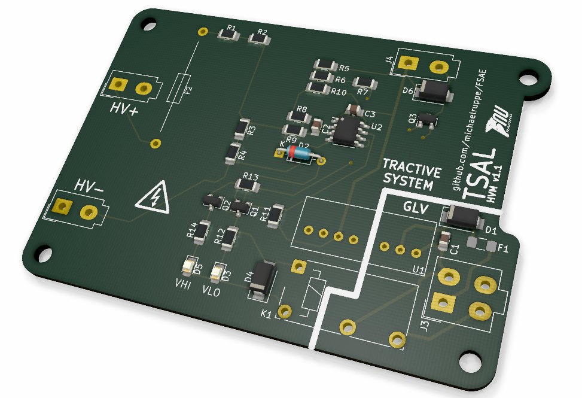
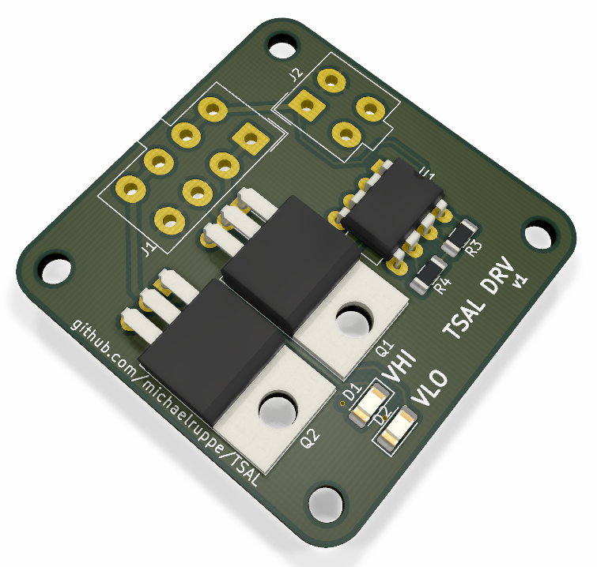

# TSAL
A comparator-based TSAL design for FSAE Electric 2019
*This repo is for the design of a system required in the Formula SAE competition 2019, and so will use common nomenclature specified in the [2019 rules v2.1](http://www.fsaeonline.com/cdsweb/gen/DocumentResources.aspx)*

The *Tractive System Active Light* is a red/green indicator light that indicates the presence of high-voltage in the Tractive System. The following design for a TSAL driver is split across two modules. The High-Voltage Measurement module (HVM) and the Indicator Module (DRV). The HVM connects to the output of the AIRs, and is located in the accumulator housing. The HVM is responsible for detecting whether Tractive System voltage is above or below the safe threshold.

## High-Voltage Measurement (HVM)

The HVM has been designed to mount above the IMD, using the same mounting-hole dimensions. This will likely require conformal coating of the board and an intermediate insulating material to meet regulation EV.6.1.5 and EV.6.1.7

The HVM is designed to **not** be user adjustable. Resistive dividers R1, R2, R3, R4 and R5, R6, R7 may be used to set the trigger threshold for the onboard comparator. As specified, the board should safely handle 400V at the HV inputs (untested). Diode D1 begins conducting when approximately 200V is present at HV inputs - effectively limiting the input voltage of the comparator.

### Pinout

| Parameter                  | Value             |
|----------------------------|-------------------|
| Max Voltage (HV+ - HV-)    | 200V DC           |
| Switching threshold (HVin) | 60V DC            |
| Supply Voltage             | 12V DC            |
| Output                     | Switched Contacts |
| HV < 60V                   | OPEN              |
| HV > 60V                   | CLOSED            |

### Assembly notes
Many parts of the v1 design are provisional.
**ToDo - assembly instructions**

### Design justification
A comparator circuit was chosen because they are relatively simple to design, are well understood and behave predictably.
An isolated power supply U1 is powered by the GLV (12V) and provides an isolated 12V supply for this circuit.

R1, R2, R3, R4 form an input voltage divider which scales the input (0-200V -> 0-12V). The voltage divider is split between multiple resistors to keep the voltage across each resistor manageable. Since each 1208 package is rated for 200VDC this topology is theoretically capable of measuring up to 400VDC. This range can be trivially increased with the addition of more resistors in the divider.

R5, R6, R7 form a resistive divider that provides a stable voltage reference of 3V for the comparator. A resistive divider was chosen over a zener voltage reference because the output of the DC-DC converter U1 should be accurate and stable enough for this application.

With the values chosen, the output of the comparator should be HIGH while input voltage is less than 60V. The output should be LOW for input voltages greater than 60V.

R9, R8, C2 form an input filter for the comparator which is prescribed in the LM311 datasheet. This prevents noise coupling from the output to the input.

R10 is included to provide hysteresis. Since hysteresis is symmetric in this circuit, it is chosen to be small so as not to significantly offset the actual switching threshold from the desired threshold.

N-Channel MOSFET, Q1 and relay K1 form the isolated output of the circuit. While the input voltage is less than 60V, R12 pulls-up the gate of Q1, energising the relay coil and closing the contacts. D3 is a status indicator and D4 is a flyback diode.

The action of Q1 is inverted in Q2 and Q3, which drive an on-board status indicator LED and an off-board status indicator respectively. R16 is a provisional current-limiting resistor should J4 be connected directly to an LED.

To comply with FSAE rules the voltage systems on board are galvanically isolated. The clearances on-board require it to be conformal coated.

## Indicator module (DRV)

The Indicator module is powered by the GLVS and controls the behaviour of the red/green TSAL. It is controlled by a single input which is pulled low by the action of the HVM. Each channel is capable of several amps and should be suitable for driving 12V LED assemblies or even incandescent bulbs.

### Pinout

| J1  | LED Connection |
|-----|----------------|
| 1   | GRN+           |
| 2   | GRN+           |
| 3   | GRN-           |
| 4   | GRN-           |
| 5   | RED+           |
| 6   | RED+           |
| 7   | RED-           |
| 8   | RED-           |

| J2 |                     |
|----|---------------------|
| 1  | +12V                |
| 2  | GND                 |
| 3  | VHI signal from HVM |
| 4  | N.C.                |

### Design Justification
The heart of the driver module is the complementary operation of the timer (U1) and the P-Channel MOSFET (Q1). The VHI signal effectively selects which of these components should be active.

When VHI (J3) is pulled to ground, Q1 switches on - driving VLO indicator LED (D2) and powering the offboard, green TSAL LEDs (J1). A low signal at VHI also holds the reset pin of the U1 low, disabling its output.

When VHI is high impedance (relay on HVM is open), R2 pulls the gate of Q1 high, turning off Q1. The RESET pin of U1 is now high, activating U1 which flashes VHI LED (D1) and the off-board red TSAL LEDs (J1).
